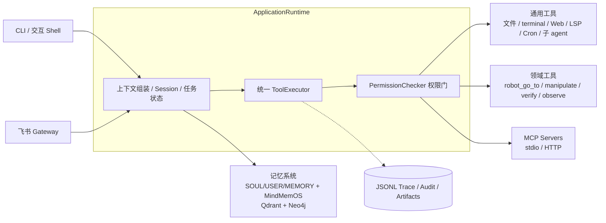

# HomeMaster

**LLM-first generic agent runtime with home-robot domain tools.**


HomeMaster 是一个以 LLM 为决策核心的通用 Agent 运行时：统一的 **ApplicationRuntime** 负责上下文组装、
任务状态快照、权限门控与工具执行，在其上组合通用工具集、家庭机器人领域工具、分层记忆系统、
飞书消息通道与 MCP 扩展生态。同一套 Runtime 驱动 CLI、交互 Shell、飞书 Gateway
（含 ALFWorld 具身环境与通用浏览器两种模式）以及 ALFWorld benchmark。

> [!IMPORTANT]
> 机器人 skill 当前运行在 `skill_mode=simulated`：navigation / operation / verification
> 由模拟执行器完成，尚未接入真实机器人、VLA 或 VLM。详见[当前边界](#当前边界)。

## 目录

- [核心能力](#核心能力)
- [架构](#架构)
- [快速开始](#快速开始)
- [CLI 参考](#cli-参考)
- [运行模式](#运行模式)
- [记忆系统](#记忆系统)
- [Skills](#skills)
- [MCP 扩展](#mcp-扩展)
- [安全模型](#安全模型)
- [Benchmark 与 Demo](#benchmark-与-demo)
- [可观测性](#可观测性)
- [当前边界](#当前边界)
- [文档](#文档)
- [开发](#开发)

## 核心能力

- **统一 Agent Runtime** — 上下文组装、Session 管理、任务状态快照、目标 grounding 和统一工具执行链，
  所有工具调用经过同一条 `ToolExecutor -> PermissionChecker` 权限门。
- **通用工具集** — 文件（`read_file` / `write_file` / `edit_file` / `search_files`）、`terminal`
  （模型自选命令，Runtime 管工作目录、超时、取消与进程组清理）、联网、LSP、图片生成/理解、
  计划模式、配置、Cron、后台任务、子 agent 与团队协作。
- **领域机器人工具** — `robot_go_to`、`robot_manipulate`、`robot_verify`、`task_progress_check`
  和共用的画面截图工具 `observe`。
- **分层记忆系统** — `SOUL.md` / `USER.md` / `MEMORY.md` 三层本地文件记忆 + embedded MindMemOS
  结构化检索（本地 Qdrant + Neo4j）；支持自动召回、用户反馈纠正、会话结束隐式反馈，以及每 8 条有效
  新增记忆触发的可恢复 dreaming。
- **飞书 Gateway** — 私聊、免 @ 群消息、thread 回复、图片/音视频/文件收发与建群/改名；
  可叠加 ALFWorld 具身环境或隔离的 Playwright 浏览器会话。
- **MCP 扩展** — 连接 stdio / streamable HTTP MCP server，discovery 结果原子注册进工具 Registry，
  tool/resource 调用全部落 JSONL audit。
- **安全模型** — typed capability 权限、generation-aware 设备租约、带双重回执的急停（emergency stop）、
  按字节 pin 的可信扩展（CL-21）。
- **可观测性** — 每次 run 落 `runtime_events.jsonl` 结构化事件轨迹，租约/断连/急停/设备审计独立成链。

## 架构



**模块布局**（`src/homemaster/`）：

| 目录 | 职责 |
| --- | --- |
| `application/` | ApplicationRuntime、SessionManager 与资源 ownership |
| `agent/` | AgentRuntime、context 组装与 provider turn |
| `tools/` | BaseTool、universal Registry、权限检查与统一执行链 |
| `domain/` | Home 机器人领域工具与目标 grounding |
| `skills/` | SkillSpec / SkillLoader / SkillRegistry 与 builtin `SKILL.md` |
| `memory/` | 分层记忆、MindMemOS pipeline 与召回基准 |
| `mcp/` | MCP 配置/客户端、Registry adapter 与 audit |
| `permissions/` | typed 配置、capability policy 与路径/命令规则 |
| `devices/` | connection pool、generation lease、急停与设备 audit |
| `channels/` `gateway/` | typed channel DTO、bounded priority bus、飞书 adapter 与 Gateway 生命周期 |
| `events/` | RuntimeEvent schema、sinks 与远程投影 allowlist |
| `artifacts/` | tenant/session/run 分区的 opaque 工具产物存储 |
| `browser/` | run-scoped Playwright 会话与语义浏览器工具 |
| `extensions/` | 受部署者批准的可信本地扩展（CL-21） |
| `config/` `providers/` `cli/` | YAML 配置、LLM/embedding provider、CLI 入口 |

## 快速开始

### 1. 安装

需要 Python 3.11+，推荐使用 [uv](https://docs.astral.sh/uv/)：

```bash
# 若无 uv：curl -LsSf https://astral.sh/uv/install.sh | sh
cd Homemaster
uv venv --python 3.11 .venv
uv sync --extra dev

# 验证安装
uv run python -c "import homemaster; print(homemaster.__version__)"
```

### 2. 配置 Provider

Provider 配置只从 YAML 真理源读取。首次配置时复制脱敏模板：

```bash
cp config/homemaster.example.yaml config/homemaster.yaml
chmod 600 config/homemaster.yaml
```

配置至少包含两类 provider（示例为占位值，字段说明见
[Skills 与配置用户指南](docs/skills-and-config-user-guide.md)）：

```yaml
providers:
  default: Mimo
  items:
    - name: Mimo            # chat provider：agent loop、检索 query、编排、总结
      kind: chat
      api_format: anthropic
      transport: anthropic_sdk
      auth_type: auth_token
      base_url: https://provider.example/anthropic
      model: your-chat-model
      api_keys: ["<your-api-key>"]
    - name: MemoryEmbedding  # embedding provider：记忆向量化（正式配置用 Qwen3-Embedding-8B）
      kind: embedding
      # ...
```

> [!WARNING]
> 真实配置已加入 `.gitignore`，真实 key 只能保留在运行机器上，绝不提交进 Git。
> 仓库中的 `config/homemaster.example.yaml` 只包含占位认证值。
> wheel 安装等非源码部署可设置 `HOMEMASTER_CONFIG_PATH=/absolute/path/homemaster.yaml`
> 指向部署配置（同样要求 mode 0600）。

优先级固定为 `defaults < file < provider-specific env < limited CLI`；provider 名转大写后支持
`HOMEMASTER_<NAME>_API_KEY` 等环境变量，通用 `ANTHROPIC_*` 环境变量不会覆盖 HomeMaster 配置。

### 3. 体检

```bash
uv run homemaster doctor --live
```

`doctor --live` 检查本地依赖与导入、API 配置可读性、Mimo 最小 JSON 调用、
MemoryEmbedding `/v1/embeddings` 调用，以及 embedded MindMemOS 导入、文件迁移状态与 backend 配置。
`doctor` 本身只读，不打开 Qdrant 或 Neo4j。

### 4. 第一个任务

```bash
# 一次性请求，实时输出纯文本
uv run homemaster -p "检查客厅" --output-format text

# 单任务运行，Rich 实时进度（只写 stderr）
uv run homemaster run --utterance "去厨房找水杯，然后拿给我" --progress

# 交互式 shell
uv run homemaster shell
```

## CLI 参考

| 命令 | 说明 |
| --- | --- |
| `homemaster` | 启动交互式 shell（Rich 展示工具进度、错误与压缩状态） |
| `homemaster -p "..."` | 一次性请求并退出；`--output-format text\|json\|stream-json` |
| `homemaster run --utterance ...` | 单任务运行，`--progress` 向 stderr 流式输出进度 |
| `homemaster --dry-run [-p ...] [--probe]` | 预览 provider/model 解析来源与已加载 Skill，无外部 I/O；`--probe` 才连接 MCP 做 discovery |
| `homemaster doctor [--live]` | 环境体检；`--live` 追加真实 provider 调用验证 |
| `homemaster session list\|show\|export\|delete\|clean` | 持久会话管理 |
| `homemaster cron start\|status\|stop` | 后台 Cron worker 管理 |
| `homemaster memory migrate --config ...` | 迁移旧版 `~/.homemaster/memories` 文件记忆 |
| `homemaster gateway --config ...` | 启动飞书 Gateway（前台进程，需手动保活） |
| `homemaster benchmark-alfworld ...` | ALFWorld benchmark 入口 |

一次性输出三种格式：`text` 实时写入 stdout、`json` 结束后输出单文档、`stream-json` 逐行
JSON Lines 且最后一行固定 `type=result`。Rich/状态信息只写 stderr，不污染机器可读的 stdout。

## 运行模式

除本地 CLI 外，HomeMaster 通过飞书 Gateway 提供远程通道（`--alfworld` 与 `--browser` 互斥）：

```bash
uv sync --extra dev --extra gateway

# 普通飞书通道：通用工具 + 远程交互
uv run homemaster --gateway --config config/homemaster.yaml

# ALFWorld 具身模式：固定 episode，每次 backend 动作后强制 observe，画面同步发模型与飞书
uv run homemaster --gateway --alfworld --config config/homemaster.yaml

# 浏览器模式：每个 run 独立、origin 受限的 Playwright 会话 + 通用浏览器工具
uv run homemaster --gateway --browser --config config/homemaster.yaml
```

- Gateway 把所有非 bot sender 映射为固定 `feishu-owner` principal；`app_id/app_secret` 只从
  mode 0600、gitignored 的真实 YAML 读取。进程退出或重启后需手动重新启动，仓库不提供守护/自启服务。
- Browser 模式下飞书正文可直接包含变更单 URL；通用 `change-ticket-executor` Skill 从票据自然语言
  动态提取步骤与验收，每次写操作后强制 `observe` 回传截图，`browser_backfill` 以 SHA-256 一致性
  校验回填。当前验收范围是 Ant Design Pro Mock UI，不代表真实业务系统变更。

详见 [Browser Gateway 用户指南](docs/browser-gateway-user-guide.md) 与
[ALFWorld 用户指南](docs/alfworld-user-guide.md)。

## 记忆系统

HomeMaster 记忆分两层：

- **三层本地文件记忆** — `SOUL.md`（部署者维护的稳定人格）、`USER.md`（用户身份与偏好）、
  `MEMORY.md`（近期事件与跨会话事项），session 首次组装上下文时冻结快照。
- **embedded MindMemOS** — 外部世界 fact 与可复用 procedure 的结构化检索库，原生 schema pipeline
  写入本地 Qdrant 与 Neo4j；写入必须绑定当前 Runtime 的 opaque evidence，所有 mutation 经原生
  返回状态和 raw memory 终态读回确认。

新 Session 的第一条用户消息（以及 Compact 完成后的下一条真实消息）会在首次 Provider 请求前
自动执行一次 MindMemOS 召回（`top_k=3`），命中结果作为仅当前 run 可见的 `<memory-context>` 注入；
Agent 仍可用 `mindmemos_search` 主动补充搜索，并用 `mindmemos_history` 按准确 ID 查看 active/archived
版本链。用户给出纠正但具体 mutation 尚未确定时，模型调用 `mindmemos_feedback`，其目标只能来自该次成功
provider request 实际可见的 raw recall。公开记忆工具共七个：`context_memory`、`mindmemos_search`、
`mindmemos_history`、`mindmemos_add`、`mindmemos_update`、`mindmemos_delete`、`mindmemos_feedback`。

交互 Session 结束后，HomeMaster 在 Vanilla Add 写后回读成功的基础上运行 operation-record implicit
feedback；同一 project/user 每累计 8 条有效普通新增 raw memory 后运行一次 native dreaming。计数与 pending
batch 持久化，失败在下次启动或 finalization 重试，只有 per-action raw/lineage 与 add-record 终态全部通过
才消费批次。阈值可用 `memory.dreaming_memory_threshold` 配置。

持久数据统一位于 `memory.data_root`（默认 `~/.homemaster/memory`）。`memory.neo4j.mode:
managed_local` 下同节点多进程共享一套托管 Neo4j（首启自动拉起、末个进程退出自动停止），
`external` 模式只连接既有服务。

配置、隐私、诊断与召回基准说明见[记忆用户指南](docs/memory-user-guide.md)，
owner 与不变量见[记忆系统架构](docs/architecture/memory-system.md)。

## Skills

Skill 是 OpenHarness 兼容的按需 instruction document：模型先看名称与简介，再用
`load_skill(name=...)` 按需读取完整 `SKILL.md`，正文不预加载。Skill 不是工具授权声明，
不能修改 Registry 或扩大 permission。

来源优先级：OpenHarness bundled < Home builtin < `~/.homemaster/skills` < 项目内
`.homemaster/skills` < 显式目录 < data-only plugin（只读 manifest 与 `SKILL.md`，绝不导入
plugin Python）。

内置 bundled skills：`commit` / `debug` / `diagnose` / `plan` / `review` / `simplify` /
`skill-creator` / `test`；builtin skills：`change-ticket-executor` / `check_object_state` /
`fetch_object`。完整示例见 [Skills 与配置用户指南](docs/skills-and-config-user-guide.md)。

## MCP 扩展

安装可选依赖后，Home application 可连接 stdio 或 streamable HTTP MCP server：

```bash
uv sync --extra dev --extra mcp
uv run homemaster --dry-run -p '检查外部工具' --output-format json   # 静态审计
uv run homemaster --dry-run -p '检查外部工具' --probe                 # 真实连接 discovery
```

真实 run 首次启动时只连接一次 MCP manager，成功的工具按普通名称原子加入 application Registry
（动态工具名为 `mcp__<server>__<tool>`），失败 server 不影响 builtin。资源入口为
`list_mcp_resources` / `read_mcp_resource`。未经真环境核对的 read-only annotation 一律按可能修改
远端状态处理（PLAN 拒绝、DEFAULT 要求确认）。tool/resource 原始结果按 tenant/session/run 写入
ACL artifact 并落 JSONL audit。

## 安全模型

- **Typed capability** — 远程 Bearer credential 只能映射到预先配置的 typed principal/tenant/capability；
  prompt、metadata、skill、slash command 与附件都不能扩权。机器人读操作要求 `device.read`，写操作
  要求 `device.control`，MCP 调用要求 `mcp.call`；后台任务、Cron、配置修改、MCP 凭证管理分别要求
  `process.spawn`、`scheduler.manage`、`config.mutate`、`mcp.manage`。
- **设备租约与 fencing** — 每个 run 边界把 backend 绑定为 tenant-pinned connection handle，与
  generation-aware FIFO lease 共用单调 generation；同一设备写动作串行、不同设备可并发；断线、
  stale generation 和急停会在 backend 前拒绝等待动作，已开始但被 fence 的动作返回不可自动重试的
  `outcome_unknown`。
- **急停** — 独立 control path，typed control receipt 成功**且**独立 typed state query 确认 stopped
  才算成功，两次返回码都进入结果与 audit。
- **可信扩展（CL-21）** — 默认关闭；部署者必须在 `extensions.approvals` 中固定 manifest 路径、
  extension id、SemVer、host 重算的 canonical SHA-256 与 deployment grants。plugin tool 权限是
  requested、deployment grant 与当前 run principal capabilities 的交集；entrypoint 从 pinned
  directory 逐级拒绝 symlink。MVP 只支持显式批准的可信本地 Python 文件，不是 hostile-code sandbox。

租约、断连、fence 和 stop 事件追加到 `observability.trace_dir/device_audit.jsonl`（mode 0600）；
audit sink 是旁路镜像，写入失败不阻断权威生命周期。

## Benchmark 与 Demo

### ALFWorld Benchmark

`AlfredThorEnv` 模式用真实 THOR scene state 评测高层规划：模型循环前验证 exact trial manifest，
执行 controlled-time reset scan 并原子发布 immutable Oracle pose snapshot；CLI 分开报告 Agent
成功率、evaluation/Harness coverage 与 Provider/Runtime availability。Harness 失败不会伪装成模型失败。

```bash
export ALFWORLD_DATA=/path/to/alfworld/data
uv run homemaster benchmark-alfworld \
  --alfworld-root /path/to/alfworld \
  --alfworld-config /path/to/alfworld/configs/base_config.yaml \
  --env-type AlfredThorEnv --split valid_unseen \
  --trace-root var/alfworld-trace --episodes 1 \
  --trial-manifest /path/to/trial-manifest.json \
  --observation-mode visual_eval
```

见 [ALFWorld 用户指南](docs/alfworld-user-guide.md) 与
[ALFWorld Harness 架构](docs/architecture/alfworld-harness.md)。

### Change Coworker Demo

`homemaster shell` 识别锁定的 `case_02` 变更单路径后，在独立 child run 中自主完成真实网页操作、
自动化 job、tmux/Bash 验证、SOP 决策、DAG 评分与 H.264 录屏；coworker 的工具、skill 与证据不进入
默认 home registry。需要 `coworker` extra 与独立的 `apps/case02_openenv` venv，
完整步骤见 [Change Coworker 用户指南](docs/coworker-demo-user-guide.md)。

### 记忆召回基准

```bash
uv run python scripts/memory_recall_benchmark.py generate --run-id hm100-test
uv run python scripts/memory_recall_benchmark.py overnight --run-id hm100-test --recall-cases 100
```

串行写入 100 条合成网页操作 fact 并分别评分 exact/paraphrase 召回、干扰项区分与自然工具路由，
支持 checkpoint/resume。见[记忆用户指南](docs/memory-user-guide.md)。

## 可观测性

每次 run 向 trace 目录写 `runtime_events.jsonl`，事件类型包括 `run_started/completed/failed`、
`turn_*`、`llm_call_*`、`tool_call_*` 等，完整 schema 见
`src/homemaster/events/runtime_events.py`。远程 progress 只来自严格 allowlist 的公共事件投影；
usage、thinking 与原始 tool 生命周期只留内部 JSONL。

## 当前边界

- **真实** — Mimo chat provider；SiliconFlow `Qwen/Qwen3-Embedding-8B` 4096 维 embedding；
  文件记忆、embedded Qdrant/BM25 检索与证据门；飞书 Gateway 文本/媒体主链路。
- **模拟** — navigation / operation / verification 机器人 skill（`skill_mode=simulated`），
  未接真实机器人、VLA、VLM。
- **Benchmark** — `AlfredThorEnv` 已接入 trial/reset/snapshot/typed-feedback 产品边界，内部回归通过，
  但完整 Gate B 与十 Episode 真实 API 证据仍不可用（Gate A 19/20，不能宣称完整 PASS）。
  Browser 模式验收范围为 Ant Design Pro Mock UI。

## 文档

| 文档 | 内容 |
| --- | --- |
| [Skills 与配置用户指南](docs/skills-and-config-user-guide.md) | Provider/CLI/环境变量、输出格式、Skill 来源与配置示例 |
| [记忆用户指南](docs/memory-user-guide.md) | 自动召回、记忆分层、Neo4j 托管模式、召回基准 |
| [记忆系统架构](docs/architecture/memory-system.md) | owner、不变量与数据流 |
| [ALFWorld 用户指南](docs/alfworld-user-guide.md) | 工具协议、trial manifest、offscreen 导航实验开关 |
| [ALFWorld Harness 架构](docs/architecture/alfworld-harness.md) | 实现不变量与数据流 |
| [Browser Gateway 用户指南](docs/browser-gateway-user-guide.md) | 配置、演示输入与终态判据 |
| [通用浏览器架构](docs/architecture/generic-browser-tools-phase1.md) | 浏览器工具不变量 |
| [Change Coworker 用户指南](docs/coworker-demo-user-guide.md) | preflight、运行、评分与产物 |
| [Change Coworker 架构](docs/architecture/coworker-demo.md) | 边界与证据流 |
| [Application Runtime 架构](docs/architecture/application-runtime.md) | Runtime owner 与数据流 |
| [pitfalls](docs/pitfalls.md) | 历史踩坑记录 |

## 开发

```bash
uv sync --extra dev          # 开发依赖（pytest / ruff）
uv run pytest                # 单测；live 标记见 pyproject.toml
uv run pytest -m live_api    # 真实外部 API 用例
uv run ruff check .          # lint（line-length 100）
```

测试标记：`live_api` / `live_alfworld` / `live_mcp` / `live_coworker` / `stress`，
分别对应真实外部 API、ALFWorld 环境、MCP server、Coworker 浏览器环境和扩展并发/泄漏测试。
