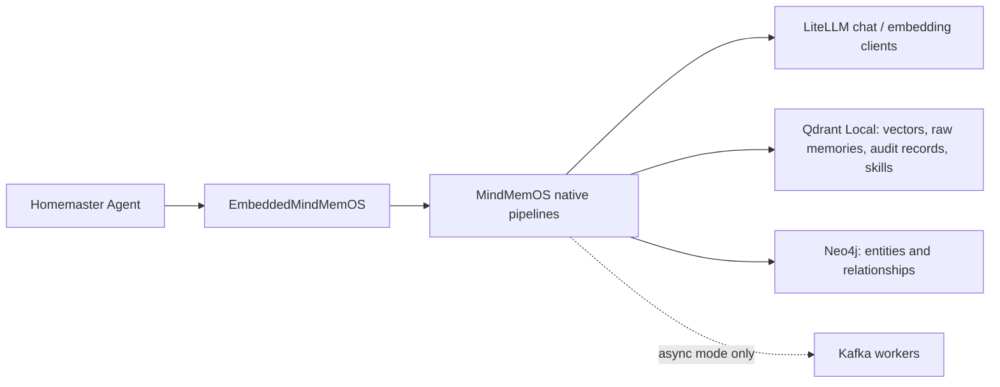

# MindMemOS 原生 Pipeline 调用与 Homemaster 集成报告

> 文档目的：说明当前 vendored MindMemOS 的功能边界、每项功能的 Python 原生调用方法、依赖和数据副作用，为后续 Homemaster 设计提供依据。  
> 代码基线：`Homemaster` 的 `mindmem` 分支，以及 `third_party/MindMemOS` 当前源码。  
> 结论口径：区分“源码提供”“单元测试通过”“真实外部依赖端到端验证通过”，避免把接口存在等同于功能已经可用。

## 1. 先给结论

Homemaster 未来可以不启动 MindMemOS HTTP 服务，直接在同一 Python 进程中创建 MindMemOS 的数据库客户端、LLM/embedding 客户端和原生 pipeline，然后调用其异步方法。这就是当前选择的 embedded/local 方案。

当前已经存在的 Homemaster 包装器是：

```text
src/homemaster/memory/mindmemos_runtime.py
```

它目前只正式暴露：

- `start()`：初始化配置、Qdrant Local、Neo4j、LLM/embedding 客户端、add/search pipeline。
- `add()`：调用原生 `schema_add.add_sync()`。
- `search()`：调用原生 `search_pipeline.search()`。
- `close()`：关闭 Neo4j/Qdrant 并清理 MindMemOS 全局配置和模型路由缓存。

MindMemOS 源码还提供 get、update、delete、feedback、dreaming、skill version store、skill evolution，但这些尚未全部接进 `EmbeddedMindMemOS` 的公开方法。

当前真实验证结果：

| 功能 | 当前状态 | 说明 |
|---|---|---|
| schema add | 已真实验证 | LLM 抽取、embedding、Qdrant、Neo4j 写入可工作 |
| schema/vanilla search | 已真实验证 | 注意 schema search 可返回聚合视图 ID |
| get/update/delete | 源码具备 | 尚未作为 Homemaster runtime 公共方法做完整端到端验证 |
| explicit feedback | 有条件真实验证通过 | 必须传原始 memory ID，不能直接把 schema 聚合视图 ID 当作可修改 ID |
| implicit feedback | 单元测试通过 | 尚未做真实端到端验证 |
| dreaming | 当前不可判定为可用 | 已进入聚类阶段，但当前 Mimo/Anthropic 路由拒绝“只有 system message”的 LLM 请求；pipeline 仍可能返回 `status="ok"` |
| skill register/read | 源码具备 | skill version 数据存 Qdrant |
| skill evolution | 已真实验证 | 8 条注入轨迹达到阈值后成功生成新的 draft/cloud 子版本 |
| Kafka 异步模式 | 当前禁用 | 同步 Python 调用不需要 Kafka；异步 add/feedback/dreaming/evolve worker 才需要 |

## 2. 运行架构



这个结构中，`EmbeddedMindMemOS` 不是另一个 memory engine，也不是 MindMemOS 的替代实现。它只是 Homemaster 持有资源生命周期和配置映射的薄包装层，实际记忆逻辑继续调用 MindMemOS 原生 pipeline。

## 3. 初始化与关闭

### 3.1 Homemaster 当前的启动方式

```python
from homemaster.memory.mindmemos_runtime import EmbeddedMindMemOS

runtime = EmbeddedMindMemOS(homemaster_config)
await runtime.start()

try:
    # 调用 add/search/... 功能
    ...
finally:
    await runtime.close()
```

`start()` 当前做了这些事情：

1. 把 Homemaster 的 chat/embedding provider 配置映射成 MindMemOS `MemoryConfig`。
2. 设置 `kafka.enabled = False`。
3. 创建 `AsyncQdrantClient(path=...)`，因此 Qdrant 运行在 Local Mode，不需要 Qdrant Server。
4. 创建 `Neo4jStore`。Neo4j 仍是外部数据库，不属于 Qdrant Local Mode。
5. 创建并初始化 Qdrant memory collection、operation record collection、skill collection 和 Neo4j schema。
6. 通过 MindMemOS 原生 `get_llm_client()`、`get_embed_client()` 创建 LiteLLM 客户端。
7. 创建 `MemoryDbReader`、`MemoryDbWriter`、`MemoryOperationRecorder`。
8. 创建原生 `schema_add` 和 `search_pipeline`。

当前配置复用了 `config/homemaster.yaml` 中已有的模型信息：

- Chat：Mimo API，经 LiteLLM 的 Anthropic 格式路由。
- Embedding：SiliconFlow 的 Qwen3-Embedding-8B，经 LiteLLM OpenAI 格式路由。
- 向量维度：4096。

因此，不需要再写一套 Homemaster 自定义的 LLM/embedding adapter。所谓 adapter 的必要职责只是把 Homemaster provider 配置翻译成 MindMemOS/LiteLLM 所需字段；这已经在 `build_mindmemos_config()` 中完成。

### 3.2 每次调用都必须有请求上下文

```python
from uuid import uuid4
from mindmemos.typing import MemoryRequestContext

ctx = MemoryRequestContext(
    request_id=str(uuid4()),
    account_id="homemaster",
    project_id="my-project",
    api_key_uuid="embedded-local",
    user_id="alice",
    app_id="homemaster",
    session_id="session-001",
    agent_id="main-agent",
)
```

字段的设计含义：

- `project_id`：最重要的硬隔离边界；查询和写入都按项目隔离。
- `user_id`：用户范围和 dreaming/feedback 活动归属。
- `session_id`：implicit feedback 会按 session 组织 add/search 记录。
- `agent_id`、`app_id`：可选的进一步过滤和追踪维度。
- `request_id`：单次调用追踪 ID。
- `account_id`、`api_key_uuid`：服务版鉴权上下文保留下来的租户字段；embedded 模式也必须给值。

Homemaster 后续不应让各 agent 随意拼这些字段，应该集中提供一个 `make_memory_context(...)`，确保同一用户、项目、会话的标识稳定。

## 4. 四种输入消息到底由谁决定

答案是：**由调用 MindMemOS 的 agent/Homemaster 代码决定传哪一种消息。MindMemOS 不会替调用者选择消息类。**

```python
from mindmemos.typing import (
    DialogueMessage,
    TextMessage,
    UrlMessage,
    FileMessage,
)
```

| 类型 | 构造方式 | 当前原生 add 中的实际行为 |
|---|---|---|
| `DialogueMessage` | `DialogueMessage(role="user", content="...", timestamp=...)` | 内容进入分段、LLM 抽取和记忆生成；保留说话角色和可选时间戳 |
| `TextMessage` | `TextMessage(text="...")` | 内容进入分段和记忆生成；可理解为无角色的普通文本，chunker 后按文本处理 |
| `UrlMessage` | `UrlMessage(url="https://...")` | **只创建 URL SourceRef，当前 segmenter 不抓取网页正文** |
| `FileMessage` | `FileMessage(file_name="a.pdf", file_path="/path/a.pdf")` | **只创建 File SourceRef，当前 segmenter 不读取或解析文件正文**；`file_type` 可由后缀推断 |

例如，对话记忆：

```python
messages = [
    DialogueMessage(role="user", content="我以后优先使用 uv 管理 Python 依赖"),
    DialogueMessage(role="assistant", content="好的，我会优先使用 uv。"),
]

result = await runtime.add(messages, ctx)
```

文件记忆不能只传一个 `FileMessage` 就期待自动提取 PDF 内容。当前正确设计是：

```python
messages = [
    FileMessage(file_name="design.pdf", file_path="/data/design.pdf"),
    TextMessage(text=parsed_pdf_text),
]

result = await runtime.add(messages, ctx)
```

即 Homemaster 的文件工具先解析正文，`FileMessage` 保留来源关系，`TextMessage` 提供实际抽取内容。URL 同理：抓取由 Homemaster 的浏览/下载工具完成，再把正文作为 `TextMessage` 传入。

## 5. MemoryType 是怎么分配的

声明的标准类型是：

```python
MemoryType = Literal[
    "profile",
    "fact",
    "experience",
    "episodic",
    "tool_trace",
    "skill_candidate",
    "file_knowledge",
]
```

它不是“调用者把内容放进系统后，一个完全没有 LLM 的 OS 自动分类”。具体取决于 add pipeline：

### 5.1 当前 Homemaster 使用的 `schema_add`

`schema_add` 会调用 LLM 做 schema 选择、实体/属性抽取等工作。最终展示用的 `memory_type` 再由 schema 标签确定性映射：

- entity type 是 `episode` / `episodes` / `episodic` -> `episodic`
- entity type 或 property name 是 `task_experience` -> `experience`
- entity type 是 `user` / `person` -> `profile`
- 其他 -> `fact`

因此 schema 模式不是“LLM 从 7 个枚举中自由选一个”，但它仍然需要 LLM 完成上游的 schema/实体抽取。当前映射也意味着 `tool_trace`、`skill_candidate`、`file_knowledge` 不会仅凭这段通用映射自动产生，需要专门的 schema、写入路径或后续扩展。

### 5.2 `vanilla_add`

vanilla 路径通过 LLM 的抽取提示让模型生成 memory 及其类型，然后 safety gate 校验结果。非法或缺失类型会被保护逻辑处理，默认可回落为 `fact`。

设计结论：Homemaster 不必先手工给每条对话记忆分类，但必须明确选用 schema 还是 vanilla；如果以后强依赖 `tool_trace`、`skill_candidate`、`file_knowledge`，不能只声明枚举，必须设计对应的生成/写入规则。

## 6. Memory 功能逐项调用

以下均为同进程 Python 原生调用，不经过 HTTP。

### 6.1 Add：从消息抽取并持久化记忆

当前 Homemaster 推荐直接调用包装器：

```python
result = await runtime.add(
    messages=[DialogueMessage(role="user", content="我偏好深色主题")],
    context=ctx,
    force_generation=True,
)

for event in result.memories:
    print(event.operation, event.memory_id, event.memory_type, event.content)
```

原生 pipeline 的等价核心调用是：

```python
from mindmemos.typing import AddPipelineInput

payload = AddPipelineInput(
    messages=messages,
    mode="sync",
    force_generation=True,
    metadata={"source": "homemaster"},
)

result = await schema_add_pipeline.add_sync(
    payload,
    ctx,
    add_record_id=add_record_id,
)
```

依赖：LLM、embedding、Qdrant、Neo4j。  
写入：raw memory、entity/property graph、向量、source relation、add operation record。  
注意：当前 `runtime.add()` 尚未开放 `metadata` 和 `event_timestamp_ms` 参数，后续应透传，而不是重写 add pipeline。

异步 add 会把请求投递给 Kafka worker；当前 `kafka.enabled=False`，因此 embedded 第一阶段只用 `mode="sync"`。

### 6.2 Search：语义/图谱检索

当前包装器：

```python
result = await runtime.search(
    "Alice 使用什么 Python 包管理器？",
    ctx,
    top_k=10,
    search_pipeline="schema",
)

for item in result.memories:
    print(item.id, item.memory_type, item.memory)
```

完整原生参数：

```python
from mindmemos.typing import SearchPipelineInput

payload = SearchPipelineInput(
    query="Alice 使用什么 Python 包管理器？",
    filters={"user_id": "alice"},
    top_k=10,
    search_pipeline="schema",  # default / schema / vanilla
    rerank=False,
    score_threshold=None,       # 只有 rerank=True 时才生效
    agentic=False,
    max_rounds=3,
)

result = await search_pipeline.search(payload, ctx)
```

依赖：Qdrant、Neo4j；具体策略可能使用 embedding、图检索或 agentic LLM。  
写入：如果像当前 wrapper 一样显式调用 recorder，会写 search operation record，供 implicit feedback 和审计使用。

关键陷阱：`schema` search 返回的 `MemorySearchItem.id` 可能是实体/属性聚合视图 ID，不一定是底层 raw memory ID。它适合展示和召回，但不能无条件交给 update/delete/feedback executor。原始可变 memory ID 应从 raw memory reader 或结果中明确保留的 lineage/reference 字段取得。

### 6.3 Get：按过滤条件列出 active raw memories

创建 pipeline：

```python
get_pipeline = create_pipeline(
    type="get",
    name="default_get",
    db_reader=reader,
    db_writer=writer,
)
```

调用：

```python
from mindmemos.typing import GetPipelineInput

result = await get_pipeline.get(
    GetPipelineInput(filters={"user_id": "alice"}, top_k=100),
    ctx,
)
```

它不做 query scoring，只列出符合过滤条件且 `status="active"` 的 raw memories。  
依赖：Qdrant/Neo4j reader 所需的数据层，不需要 LLM。  
写入：无。

### 6.4 Update：按 raw memory ID 原地替换内容

```python
update_pipeline = create_pipeline(
    type="update",
    name="default_update",
    db_reader=reader,
    db_writer=writer,
)

from mindmemos.typing import UpdatePipelineInput

result = await update_pipeline.update(
    UpdatePipelineInput(memory_id=raw_memory_id, content="Alice 现在使用 uv"),
    ctx,
)
```

只允许更新当前项目内的 active raw memory；空内容会返回 error。  
依赖：DB reader/writer 和 embedding client，因为内容变化后向量需要同步。  
写入：更新 memory 内容和相关索引。  
注意：这里需要 raw memory ID，不能直接使用 schema 聚合搜索结果 ID。

### 6.5 Delete：归档记忆

```python
delete_pipeline = create_pipeline(
    type="delete",
    name="default_delete",
    db_reader=reader,
    db_writer=writer,
)

from mindmemos.typing import DeletePipelineInput

result = await delete_pipeline.delete(
    DeletePipelineInput(memory_id=raw_memory_id),
    ctx,
)
```

这里的 delete 是逻辑删除/归档，不是物理删除数据库记录。  
依赖：DB writer；不需要 LLM。  
写入：把目标 memory 变为 archived，并保留可追踪关系。

## 7. Feedback 功能

Feedback 的作用不是简单保存一条用户评论，而是让 LLM 根据反馈规划 `add`、`update`、`delete` 或 `noop`，然后由 executor 修改 memory DB。

### 7.1 Explicit feedback：用户明确说记忆错了

输入必须包含：

1. `feedback`：用户明确反馈文本。
2. `messages`：本轮完整对话上下文。
3. `recalled_memories`：本轮实际召回并影响回答的记忆。

```python
from mindmemos.typing import (
    DialogueMessage,
    FeedbackPipelineInput,
    MemorySearchItem,
)

payload = FeedbackPipelineInput(
    feedback="这条记忆过时了，我已经改用 uv，不再使用 conda。",
    messages=[
        DialogueMessage(role="user", content="我现在用什么管理 Python 环境？"),
        DialogueMessage(role="assistant", content="你使用 conda。"),
        DialogueMessage(role="user", content="不对，我已经改用 uv。"),
    ],
    recalled_memories=[
        MemorySearchItem(
            id=raw_memory_id,
            memory="Alice 使用 conda",
            memory_type="fact",
            last_update_at="2026-08-05 10:00:00",
        )
    ],
    mode="sync",
)

result = await feedback_pipeline.feedback_sync(payload, ctx)
```

推荐的 embedded 构造方式：

```python
planner = DefaultExplicitFeedbackPlanner(llm_client=llm)
executor = FeedbackActionExecutor(
    db_reader=reader,
    db_writer=writer,
    embed_client=embed,
)
explicit = ExplicitFeedbackHandler(
    planner=planner,
    executor=executor,
    search_pipeline=search_pipeline,
)
feedback_pipeline = DefaultFeedbackPipeline(explicit_handler=explicit)
```

依赖：LLM、搜索 pipeline、DB reader/writer、embedding。  
写入：按规划执行 add/update/delete/noop。  
真实验证结论：传 raw memory ID 时，旧 memory 被归档并产生更新后的 active memory；传 schema 聚合视图 ID 时，LLM 可以规划正确动作，但 executor 找不到目标 raw memory。

### 7.2 Implicit feedback：从后续行为推断先前回答有问题

不传 `feedback` 时，默认路由到 implicit handler：

```python
payload = FeedbackPipelineInput(
    feedback=None,
    messages=[],
    recalled_memories=[],
    mode="sync",
)

result = await feedback_pipeline.feedback_sync(payload, ctx)
```

它会读取最近 add/search operation records，按 `session_id` 组织对话轮次，用 LLM 森信号，再规划并执行 memory action，最后把相关 add records 标记为 `feedback_processed`。

它成立的前提是：

- Homemaster 的 add/search 必须持续写 operation records。
- 同一会话必须使用稳定的 `session_id`。
- search record 必须准确记录“实际提供给 agent 的 recalled memories”，而不只是搜索候选全集。
- schema aggregate ID 与 raw memory ID 的边界必须修正或显式映射。

当前只有单元测试覆盖，尚未完成真实 LLM + Qdrant + Neo4j 端到端验证，所以暂时不能标记为生产可用。

### 7.3 Feedback 异步模式

```python
payload = payload.model_copy(update={"mode": "async"})
result = await feedback_pipeline.feedback_async(payload, ctx)
```

这会发到 Kafka topic `memory.feedback`，不会在当前请求中执行修改。当前 embedded 配置禁用 Kafka，因此暂不使用。

## 8. Dreaming：后台记忆整理

Dreaming 会从近期 add/search 审计记录中找到“热记忆”，按共享实体或直接关系组成 scope/cluster，然后：

1. 确定性归档完全重复项。
2. LLM 第一次调用检测冲突、重复或可合并关系。
3. LLM 第二次调用规划 archive/create/link/update 动作。
4. 执行动作，并把 add records 标记为 consolidated。

同步调用：

```python
from mindmemos.components.activity import RecentActivityCollector
from mindmemos.typing import DreamingPipelineInput

dreaming_pipeline = create_pipeline(
    type="dreaming",
    name="default_dreaming",
    db_reader=reader,
    db_writer=writer,
    llm_client=llm,
    embed_client=embed,
    activity_collector=RecentActivityCollector(qdrant_store),
)

result = await dreaming_pipeline.dream_sync(
    DreamingPipelineInput(mode="sync"),
    ctx,
)
```

异步调用：

```python
result = await dreaming_pipeline.dream(
    DreamingPipelineInput(mode="async"),
    ctx,
)
```

异步版本只投递 Kafka topic `memory.dreaming`。

当前真实验证发现两个重要问题：

1. schema add 的 operation record 中，`memories[].memory_id` 可能保存聚合视图 ID，而 raw memory ID 在 `related_memory_ids`；activity collector 用前者取图节点时会得到 0 个 scope。
2. 修正测试记录为 raw IDs 后，dreaming 能形成 `scopes=1, clusters=1`，但 relation-detection 请求只有 system message。当前 Anthropic/Mimo 路由要求至少一个非 system message，因此该 LLM 调用失败。

更危险的是，dreaming 内部会捕获部分 LLM 异常并继续，最终仍可能返回：

```text
status = "ok"
actions = 0
```

所以不能仅以 `status="ok"` 判断 dreaming 成功；Homemaster 后续需要检查 summary 中的 scopes/clusters/actions、错误日志和 consolidated 标志。在修复 prompt 消息结构并完成真实回归前，不应自动定时启用 dreaming。

## 9. Skill 版本管理与进化

Skill 功能和普通 memory pipeline 是相邻但独立的一组能力。Skill 内容/version/blob 存在 Qdrant skill repository 中，evolution 再读取 add operation records 中的 skill bindings 和任务轨迹。

### 9.1 注册一个 skill 版本

```python
from mindmemos.pipelines.skill.version_store import SkillVersionStore

skill_store = SkillVersionStore(
    skill_repo=clients.skill,
    add_record_repo=clients.qdrant.add_record,
)

version = await skill_store.register(
    project_id=ctx.project_id,
    name="python-env-manager",
    content="""---
name: python-env-manager
description: Manage Python environments
---
# Instructions
Prefer uv for dependency and environment management.
""",
    version_label="v1",
    parent_version_id=None,
)
```

`register()` 按 `(project_id, content_hash, parent_version_id)` 幂等。根版本创建新的 `cloud_skill_id`；给出 parent 时沿用同一 skill lineage。

### 9.2 列出、读取版本和内容

```python
skills = await skill_store.list_skills(project_id=ctx.project_id)

summary = await skill_store.get_skill(
    project_id=ctx.project_id,
    cloud_skill_id=cloud_skill_id,
)

versions = await skill_store.versions_since(
    project_id=ctx.project_id,
    cloud_skill_id=cloud_skill_id,
    since=None,
)

content = await skill_store.get_content(
    project_id=ctx.project_id,
    cloud_skill_id=cloud_skill_id,
    version_id=version_id,
)
```

### 9.3 删除和同步 skill

```python
await skill_store.delete_skill(
    project_id=ctx.project_id,
    cloud_skill_id=cloud_skill_id,
)

results = await skill_store.sync(
    project_id=ctx.project_id,
    items=sync_items,
)
```

`sync()` 用于 edge/local 与 cloud 风格版本数据的批量同步；Homemaster 第一阶段如果只做本机使用，不必优先设计 cloud sync。

### 9.4 让 skill evolution 有数据可用

Evolution 不是“注册 skill 后自动改写”。它需要 add operation records 中存在：

- `skill_bindings`，且 usage 是 `injected`。
- binding 中的 `version_id` 属于该 skill lineage。
- 完整 trajectory/transcript。
- 可选任务 `score`、`task_id`。
- 未被以前的 evolution summary 消费。

也就是说，Homemaster 在 agent 执行任务时必须记录“这次任务注入了哪个 skill 版本”和执行轨迹，否则 evolver 没有学习材料。

当前原生 `AddPipelineInput` 只有 `messages/event_timestamp/mode/force_generation/metadata`，没有直接的 `skill_context`、`score`、`task_id` 字段。HTTP SDK/service 层会额外处理这些业务字段；embedded 设计不能误以为把它们传给 `AddPipelineInput` 就能工作，必须在 operation recorder/skill binding 的调用边界显式接入。

### 9.5 执行 skill evolution

```python
from mindmemos.pipelines.skill.evolution import SkillEvolver

evolver = SkillEvolver(
    store=skill_store,
    skill_repo=clients.skill,
    add_record_repo=clients.qdrant.add_record,
    llm_client=llm,
)

result = await evolver.evolve(
    project_id=ctx.project_id,
    cloud_skill_id=cloud_skill_id,
)
```

处理流程：

1. 找到该 skill lineage 的 head version。
2. 收集所有注入过该 skill、尚未总结/消费的任务轨迹。
3. 数量达到 `skill_evolution.min_aggregate` 才开始；当前真实验证阈值为 8。
4. LLM 分别总结轨迹。
5. 聚合 summary，LLM 生成 patch 并应用到 `SKILL.md`。
6. 基于 parent version 创建新的 draft/cloud child version。
7. 标记 summaries 已被新版本消费。

真实验证已成功用 8 条轨迹生成新版本：

```text
parent version: d25aec56-f288-543e-9afa-21a80db7d81d
new version:    71b4f08b-1c4c-52b7-b257-190c26faefbb
```

这个结果证明同步、原生 Python 的 skill evolution 可以在当前 LLM/Qdrant 配置上运行，不要求 Kafka。若以后做异步队列触发，才需要 Kafka worker。

## 10. Operation records 为什么是核心数据，不是附属日志

MindMemOS 的 add/search record 同时服务于：

- 审计和可观测性。
- implicit feedback 的会话重建。
- dreaming 的近期活动和 hot memory 选择。
- skill evolution 的 skill injection trajectory。

因此 Homemaster 不能只调用底层写库函数而跳过 recorder。每次 add/search 至少应记录：

- context：project/user/session/agent/app。
- 请求消息或 query。
- 实际写入的 raw memory IDs。
- 实际提供给 agent 的 recalled memory IDs。
- 请求/完成时间和 status。
- skill binding、trajectory、score、task_id（如果该任务使用 skill）。

当前最需要修正的共同问题，是 schema 聚合视图 ID 与 raw memory ID 混用。它同时影响 feedback、dreaming、operation record 的后续消费。

## 11. 同步模式和 Kafka 的边界

| 功能 | 同步原生调用 | 异步调用 |
|---|---|---|
| add | `add_sync(...)`，不需要 Kafka | 排队给 add worker，需要 Kafka |
| feedback | `feedback_sync(...)`，不需要 Kafka | `feedback_async(...)`，需要 Kafka |
| dreaming | `dream_sync(...)`，不需要 Kafka | `dream(...)`，需要 Kafka |
| skill evolve | `evolver.evolve(...)`，不需要 Kafka | service/worker 定时或排队触发时需要 Kafka |
| search/get/update/delete | 当前就是请求内执行 | 没有必要第一阶段异步化 |

所以官方项目带 Kafka 并不表示所有功能必须 Docker/Kafka 才能使用。它主要支撑服务化部署中的后台任务、削峰和 worker 解耦。Homemaster 当前 local embedded 方案可以先完整走同步调用。

## 12. 推荐给 Homemaster 的最终公开接口

保持 wrapper 薄，不复制 MindMemOS 算法：

```python
class EmbeddedMindMemOS:
    async def start(self) -> None: ...
    async def close(self) -> None: ...

    async def add(self, messages, context, **options): ...
    async def search(self, query, context, **options): ...
    async def get(self, context, *, filters=None, top_k=None): ...
    async def update(self, memory_id, content, context): ...
    async def delete(self, memory_id, context): ...

    async def feedback_explicit(
        self, feedback, messages, recalled_raw_memories, context
    ): ...
    async def feedback_implicit(self, context): ...
    async def dream(self, context): ...

    async def register_skill(self, ...): ...
    async def list_skills(self, ...): ...
    async def get_skill(self, ...): ...
    async def evolve_skill(self, ...): ...
```

建议分阶段接入：

1. 先把 add/search/get/update/delete 接入 Homemaster runtime，并统一 context 和 raw ID 语义。
2. 再接 explicit feedback；它最容易与用户纠错动作形成清晰闭环。
3. 接 skill binding/trajectory recorder，再开放 skill evolution。
4. 修复 operation record ID 和 dreaming prompt 后，再启用 dreaming。
5. 最后根据吞吐量决定是否引入 Kafka 异步 worker，而不是一开始就引入。

## 13. HTTP SDK 与原生 pipeline 的关系

MindMemOS 也提供：

```python
from mindmemos import MindMemOSClient

client = MindMemOSClient(api_key="...", base_url="http://...")
await client.memory.add(...)
await client.memory.search(...)
await client.memory.feedback(...)
```

这条路径会调用 MindMemOS HTTP API，适合独立服务部署。当前 Homemaster 已选择同进程 embedded 方案，因此最终运行路径应使用本报告前面的原生 pipeline，而不是在本进程内再绕 HTTP 调自己。

SDK 文档中出现的某些 convenience 字段属于 API/service 层，不保证与 `AddPipelineInput` 一一对应；做 embedded 集成时必须以 `mindmemos.typing` 和具体 pipeline 方法签名为准。

## 14. 后续设计前必须解决的阻断点

这次集成并不是“git 进来、换个配置就全部完成”。基础 add/search 确实接近这个复杂度，但完整替代 mem0 还需要解决以下明确问题：

1. **生命周期接入**：`EmbeddedMindMemOS` 尚未挂进 Homemaster 正式启动/关闭流程。
2. **接口补全**：wrapper 目前只有 add/search，缺 get/update/delete/feedback/dreaming/skill。
3. **ID 语义**：schema aggregate view ID 与 raw memory ID 必须同时保留且禁止混用。
4. **文件/URL ingestion**：MindMemOS 当前只记 source ref，正文解析要由 Homemaster 提供。
5. **审计数据正确性**：add/search record 必须记录实际 raw writes 和实际 recalled inputs。
6. **skill trajectory**：必须把 agent 的 skill injection、任务轨迹、分数接进 operation record。
7. **dreaming provider 兼容**：relation detection prompt 至少要产生一个非 system message，并增加失败可观测性。
8. **旧 mem0 迁移面**：除了 `Mem0MemoryStore`，还要逐一判断 file memory、runtime object memory、evidence ledger 是否属于 MindMemOS 的替换范围；它们不是因为 vendored MindMemOS 就自动迁移。

## 15. 主要源码索引

- Homemaster embedded runtime：`src/homemaster/memory/mindmemos_runtime.py`
- Pipeline I/O 类型：`third_party/MindMemOS/src/mindmemos/mindmemos/typing/service.py`
- 消息、context、MemoryType：`third_party/MindMemOS/src/mindmemos/mindmemos/typing/memory.py`
- Message segmenter：`third_party/MindMemOS/src/mindmemos/mindmemos/components/chunker/segmenter.py`
- Schema memory type 映射：`third_party/MindMemOS/src/mindmemos/mindmemos/components/extractor/schema/_schema_utils.py`
- Schema add：`third_party/MindMemOS/src/mindmemos/mindmemos/pipelines/add/schema/schema_add.py`
- Vanilla add：`third_party/MindMemOS/src/mindmemos/mindmemos/pipelines/add/vanilla/vanilla_add.py`
- Search：`third_party/MindMemOS/src/mindmemos/mindmemos/pipelines/search/`
- Get/update/delete：`third_party/MindMemOS/src/mindmemos/mindmemos/pipelines/{get,update,delete}/default.py`
- Feedback：`third_party/MindMemOS/src/mindmemos/mindmemos/pipelines/feedback/`
- Dreaming：`third_party/MindMemOS/src/mindmemos/mindmemos/pipelines/dreaming/default.py`
- Recent activity：`third_party/MindMemOS/src/mindmemos/mindmemos/components/activity/collector.py`
- Skill version store：`third_party/MindMemOS/src/mindmemos/mindmemos/pipelines/skill/version_store.py`
- Skill evolution：`third_party/MindMemOS/src/mindmemos/mindmemos/pipelines/skill/evolution.py`
- Python HTTP SDK 参考：`third_party/MindMemOS/skills/mindmemos-cli/references/python-sdk.md`

