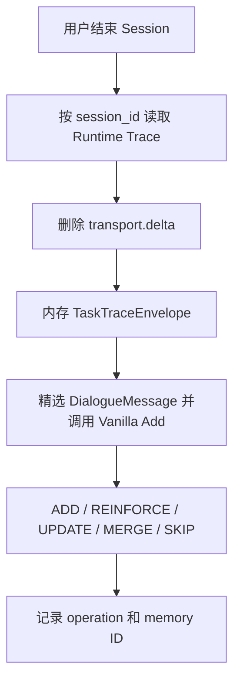

# HomeMaster Session 结束后自动沉淀经验计划

第一版固定采用下面的路线：

> 默认将一个 Session 视为一个 Task Episode。Session 主动结束后，HomeMaster 汇总该 Session 的真实工具执行轨迹，并交给 MindMemOS 原生 Vanilla Add 自主判断是否形成经验以及如何处理历史记忆。

第一版优先跑通工具轨迹的自动 Add，不强制验证一个 Session 中是否真的只包含一个任务，也暂不处理图片内容。

## 一、触发时机

定义统一入口：

```text
finalize_session()
```

以下行为表示当前 Session 结束，并自动触发 `finalize_session()`：

- 用户在 Shell 输入 `/exit`；
- Shell 收到 EOF；
- 用户在 Shell 输入提示符处按 Ctrl+C 退出；
- 用户输入 `/new`，结束旧 Session 并切换到新 Session。

当前 Run 正在执行时按 Ctrl+C，只取消该 Run，不结束 Session，也不立即触发经验 Add。用户可以在同一个 Session 中继续输入；之后真正退出 Shell 或输入 `/new` 时，再为整个 Session 触发一次 Add。

`finalize_session()` 第一版执行：

1. 从当前 Application 的 Runtime Trace 中取出目标 Session 的全部事件；
2. 在内存中构造 `TaskTraceEnvelope` 并渲染精选 `DialogueMessage`；
3. 创建轻量 Experience Add Job；
4. 调用 MindMemOS 原生 Vanilla Add；
5. 记录 Vanilla Add 返回的 operation 和 memory ID；
6. 关闭旧 Session 或切换到新 Session。

成功、失败、取消和部分完成的轨迹都可以进入 Vanilla Add。纯聊天或没有可复用内容的 Session，MindMemOS 可以不生成新经验或按照原生逻辑执行 `SKIP`。

## 二、完整处理链路



## 三、HomeMaster 负责什么

HomeMaster 不提炼经验，不判断什么值得记，只准备真实的任务轨迹输入。

### 1. 收集 Session 轨迹

从当前 Application 的 `runtime_events.jsonl` 中，直接保留 `session_id` 等于目标 Session 的全部事件。

JSONL 是按事件写入顺序追加的，因此第一版保持文件中的原始顺序，不再次按 timestamp 排序。每条 RuntimeEvent 已经包含 `run_id`，不需要先收集所有 `run_id` 再扫描一次 Trace。

第一版重点保留：

- 用户输入；
- 模型思考与最终回复；
- 工具调用名称和参数；
- 工具执行结果；
- 工具失败、Runtime 异常、取消和重试；
- 工具成功、失败、取消和重试的语义结果。

### 2. 最低限度处理

第一版只做以下处理：

- 按 `session_id` 筛选事件；
- 删除 `transport.delta` 流式碎片，因为完整思考或回复已经由终态事件保存；
- 在内存 `TaskTraceEnvelope` 中保持事件原序；
- 渲染用户文本、模型思考、非空助手回复、工具名称/参数/结果和 Session 结束原因；
- 删除 transport、usage、内部 ID、空工具调用回复和重复终态。

第一版暂不做：

- 不总结或改写工具结果；
- 不截断普通文本；
- 不总结或改写被选中的语义文本；
- 不处理图片内容，也不把图片 Base64 或图片文件交给 MindMemOS；
- 不调用额外视觉模型生成图片描述。

如果现有文本事件中已经包含 Agent 对图片的文字理解，该文字仍作为普通 Trace 内容保留；但图片本身不属于第一版经验 Add 的输入范围。

### 3. 不预先判断任务 outcome

HomeMaster只提供 Runtime 中已经存在的客观事实，例如：

- 用户输入；
- 工具执行成功或失败；
- Run 被取消；
- Runtime 异常；
- TaskState 和 AgentState；
- 模型思考和最终回复；
- Session 的结束时间和退出原因。

HomeMaster 不额外生成或固定：

```text
success / failed / cancelled / partial
```

任务语义上的 outcome 由 MindMemOS Vanilla Add 内部的 LLM 根据完整轨迹理解，并体现在所抽取的经验内容中。第一版不要求 MindMemOS 额外返回结构化 `outcome` 字段。

## 四、MindMemOS 负责什么

第一版使用原生 **Vanilla Add**，暂不使用 Schema Add。

MindMemOS 负责：

- 理解用户目标、工具执行过程、失败和最终回复；
- 判断轨迹中是否存在值得长期保存的内容；
- 提取成功经验、失败经验、注意事项和可复用步骤；
- 自行决定生成多少条 Memory；
- 向量化并写入 Qdrant；
- 保存 Add Operation Record；
- 遵循原生 Vanilla Add 逻辑执行 `ADD / REINFORCE / UPDATE / MERGE / SKIP`。

HomeMaster 不干预 Vanilla Add 对相关历史 Memory 的召回、去重、强化、更新、合并或跳过决策。

一次 Session 可能产生：

```text
0 条：没有值得保存的内容，或原生逻辑决定 SKIP
1 条：形成一条完整任务经验
N 条：拆成多条细粒度经验
```

第一版不人为限制数量，后续根据真实召回效果再调整。

## 五、TaskTraceEnvelope

`TaskTraceEnvelope` 是仅驻留内存的收集边界，不直接交给 MindMemOS，也不落盘。Renderer 从中选择语义字段并生成带角色的 `DialogueMessage`。

第一版内存结构概念如下（内部 ID 仅供 Renderer 选择和排序，不进入 MindMemOS 消息）：

```json
{
  "session": {
    "session_id": "session-001",
    "started_at": "2026-08-12T10:00:00+08:00",
    "ended_at": "2026-08-12T10:35:00+08:00",
    "exit_reason": "user_exit"
  },
  "events": [
    {
      "type": "runtime.turn_started",
      "session_id": "session-001",
      "run_id": "run-01",
      "turn_index": 1,
      "tool_call_id": null,
      "name": null,
      "timestamp": "2026-08-12T10:00:01+08:00",
      "payload": {
        "user_text": "检查服务状态并修复问题"
      }
    },
    {
      "type": "tool.call_started",
      "session_id": "session-001",
      "run_id": "run-01",
      "turn_index": 1,
      "tool_call_id": "tool-call-01",
      "name": "check_service",
      "timestamp": "2026-08-12T10:00:10+08:00",
      "payload": {
        "arguments": {
          "service": "gateway"
        }
      }
    },
    {
      "type": "tool.call_completed",
      "session_id": "session-001",
      "run_id": "run-01",
      "turn_index": 1,
      "tool_call_id": "tool-call-01",
      "name": "check_service",
      "timestamp": "2026-08-12T10:00:13+08:00",
      "payload": {
        "result": "gateway 服务未运行"
      }
    },
    {
      "type": "assistant.thinking",
      "session_id": "session-001",
      "run_id": "run-01",
      "turn_index": 1,
      "tool_call_id": null,
      "name": null,
      "timestamp": "2026-08-12T10:00:15+08:00",
      "payload": {
        "thinking": "需要根据检查结果恢复服务并再次验证。"
      }
    },
    {
      "type": "assistant.reply",
      "session_id": "session-001",
      "run_id": "run-02",
      "turn_index": 2,
      "tool_call_id": null,
      "name": null,
      "timestamp": "2026-08-12T10:34:50+08:00",
      "payload": {
        "reply": "gateway 已恢复运行，检查结果正常。"
      }
    }
  ]
}
```

`exit_reason` 只描述 Session 为什么结束，不代表任务是否成功。第一版使用：

```text
user_exit / eof / new_session / shell_interrupt
```

精选消息作为 Vanilla Add 的 `DialogueMessage` 列表。调用 Metadata 使用：

```json
{
  "source_type": "homemaster_session_experience",
  "source_session_id": "session-001",
  "input_hash": "sha256:...",
  "extractor_version": "experience-v2"
}
```

内部 `run_id` 可用于事件排序和关联，但 Renderer 不把它、`event_id` 或 `tool_call_id` 写进模型输入。

## 六、Trace 和运行数据路径

HomeMaster Git 项目源码位于：

```text
/hpc2hdd/home/wyuan140/weilin_workspace/Homemaster
```

这一路径保存源码、测试、计划和配置文件，不用于保存用户的长期运行数据。

当前 HPC 用户的 home 是：

```text
/hpc2hdd/home/wyuan140
```

因此：

```text
~/.homemaster
```

实际展开为：

```text
/hpc2hdd/home/wyuan140/.homemaster
```

这里用于保存 Session、Trace、Memory、Qdrant 和 Evidence 等运行数据。代码仓库和运行数据分离，更新代码不会删除长期记忆，运行数据也不会进入 Git。

Runtime Trace 默认根目录为：

```text
~/.homemaster/trace
```

具体的 `runtime_events.jsonl` 路径由配置项 `observability.trace_dir` 和当前 `HomeApplicationBundle.trace_path` 决定。经验模块必须使用 Application 已解析的 `trace_path`，不能硬编码 `/tmp/homemaster/...` 或其他固定路径。

Session 结束时不另存输入快照。原始 `runtime_events.jsonl` 是唯一持久化完整轨迹；`experience_jobs/<job_id>/job.json` 只记录幂等状态和操作结果。

## 七、轻量 Job 和重复触发

第一版生成：

```text
job_id = hash(session_id + input_hash + extractor_version)
```

第一版只做轻量处理：

- 已完成的同一 `job_id` 不再次调用 Add；
- 记录 Job 的 `pending / completed / failed` 状态；
- 记录 Vanilla Add 返回的 operation 和 memory ID；
- Vanilla Add 没有产生新 Memory 或返回 `SKIP` 不视为系统失败；
- Add 失败不能阻止 Session 正常关闭；
- 第一版不追求进程崩溃窗口下严格的 exactly-once，后续如有需要再补充。

## 八、Debug 输出和人工观察

在 HomeMaster 现有日志系统上新增快捷开关：

```bash
homemaster --debug
```

`--debug` 等价于将程序日志等级设置为 DEBUG；现有 `--log-level` 继续保留。它不等同于 `--verbose`：`--verbose` 用于显示完整模型思考和工具结果，`--debug` 用于观察 Session Finalizer 和 MindMemOS Vanilla Add 的内部处理过程。

非 Debug 模式至少显示简要状态：

```text
[experience] Finalizing session session-001
[experience] Starting MindMemOS Vanilla Add
[experience] Vanilla Add completed: 2 operations
Goodbye
```

Debug 模式在 Session 结束时显示：

- 当前 `session_id` 和 `exit_reason`；
- 读取的 `runtime_events.jsonl` 路径；
- 收集的事件数量和删除的 `transport.delta` 数量；
- 渲染后的 `DialogueMessage` 数量；
- Vanilla Add 开始、结束和总耗时；
- 每个实际返回的 operation；
- memory ID、memory type 和完整经验内容；
- `MERGE` 操作的来源 Memory IDs；
- 失败类型和失败原因。

示例：

```text
DEBUG experience: finalizing session=session-001 exit_reason=user_exit
DEBUG experience: reading trace=/hpc2hdd/home/wyuan140/.homemaster/trace/.../runtime_events.jsonl
DEBUG experience: collected_events=42 excluded_transport_deltas=318
DEBUG experience: rendered_messages=18
DEBUG experience: starting vanilla_add event_count=42

[experience][ADD]
memory_id: mem-001
memory_type: experience
content:
检查 gateway 服务时，应先查询当前状态；如果服务未运行，启动后必须再次检查状态，确认服务真正恢复。

[experience][REINFORCE]
memory_id: mem-003
memory_type: experience
content:
执行服务恢复操作后，应通过第二次状态检查验证结果。

DEBUG experience: vanilla_add completed operations=2 duration_ms=18432
Goodbye
```

`UPDATE` 显示更新后的完整内容；`MERGE` 同时显示新内容和 `merged_from`。如果没有实际操作，则显示：

```text
[experience] Vanilla Add completed: 0 operations
```

Vanilla Add 内部的 `SKIP` 候选通常不会出现在 `result.memories` 中，因此第一版不承诺逐条打印被跳过的候选。`0 operations` 只表示没有新增、强化、更新或合并 Memory。

第一版不为这些 Debug 日志新增 `experience.*` RuntimeEvent；日志直接输出到当前终端。程序完成或结束本次 Add 后再打印 `Goodbye`。

## 九、第一版暂时不做

- 不强制一个 Session 只能包含一个 Task；
- 不强制一个 Task 只能生成一条经验；
- 不使用 Schema Add；
- 不限制 Vanilla Add 的 `REINFORCE / UPDATE / MERGE / SKIP`；
- 不调用 Feedback；
- 不调用 Dreaming；
- 不触发 Skill Evolution；
- 不处理图片内容；
- 不总结、裁剪或改写普通文本和工具结果；
- 不由 HomeMaster 预先判断任务 outcome；
- 不做独立经验服务、复杂后台 outbox 或严格 exactly-once。

## 十、需要新增的模块

```text
SessionFinalizer
    ├── SessionTraceCollector
    ├── TaskTraceBuilder
    ├── ExperienceJobStore
    └── MindMemOS Vanilla Add Adapter
```

概念调用关系：

```python
async def finalize_session(session_id: str, exit_reason: str):
    events = trace_collector.collect(
        trace_path=application_bundle.trace_path,
        session_id=session_id,
        exclude_types={"transport.delta"},
    )
    envelope = task_trace_builder.build(
        session_id=session_id,
        exit_reason=exit_reason,
        events=events,
    )
    job = experience_jobs.create_idempotently(envelope)
    messages = experience_renderer.render(envelope)
    result = await mindmemos.add_vanilla(
        messages=messages,
        context=envelope.memory_context(),
        metadata=envelope.metadata(),
    )
    experience_jobs.complete(job.id, result.memories)
```

## 十一、完成标准

1. 一个 Session 可以跨多个 Run 汇总完整工具轨迹；
2. `/exit`、EOF、Shell 输入提示符处 Ctrl+C 和 `/new` 会自动触发；
3. 当前 Run 执行期间的 Ctrl+C 只取消 Run，不结束 Session；
4. 自动 Add 不依赖 Agent 主动调用 `add_memory`；
5. 内存 Envelope 保留目标 Session 的有序 RuntimeEvent，Renderer 只选择有价值的语义字段；
6. 用户输入、模型思考、最终回复、工具参数、工具结果和失败轨迹进入 Vanilla Add；
7. MindMemOS 可以按照原生逻辑执行 `ADD / REINFORCE / UPDATE / MERGE / SKIP`；
8. 每条返回结果通过 `source_session_id` 和 `input_hash` 追溯到原 Session，内部 ID 不进入模型正文；
9. `TaskTraceEnvelope` 仅驻留内存，完整持久化轨迹只使用已有 `runtime_events.jsonl`；
10. Add 失败不影响 Session 正常关闭；
11. 第一版不处理图片，也不预先生成结构化 outcome；
12. 重启后已经写入 MindMemOS 的经验仍可召回。
13. `homemaster --debug` 能显示事件数量、渲染消息数量、处理耗时，以及每个实际 operation 的 Memory ID、类型和完整内容；

第一版的职责边界固定为：**HomeMaster 在 Session 结束时从真实工具轨迹渲染精选语义消息；MindMemOS 按原生 Vanilla Add 逻辑理解任务、判断记什么，并完成经验的生成、强化、更新、合并、跳过和存储。**
